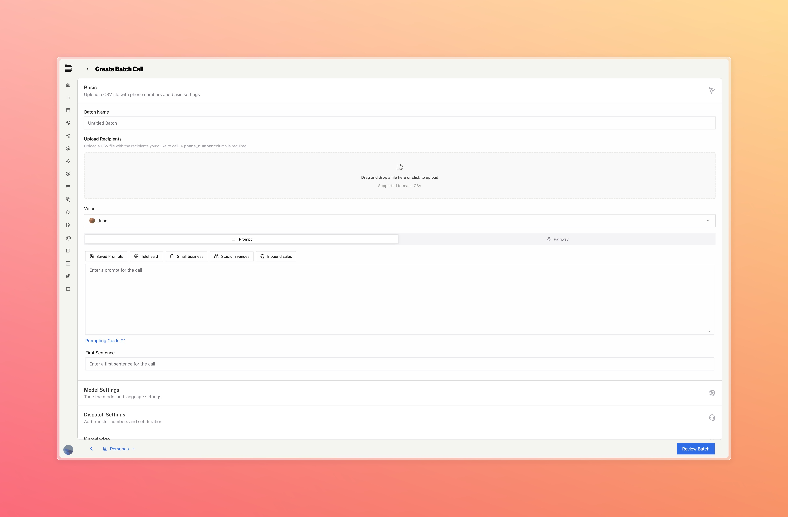
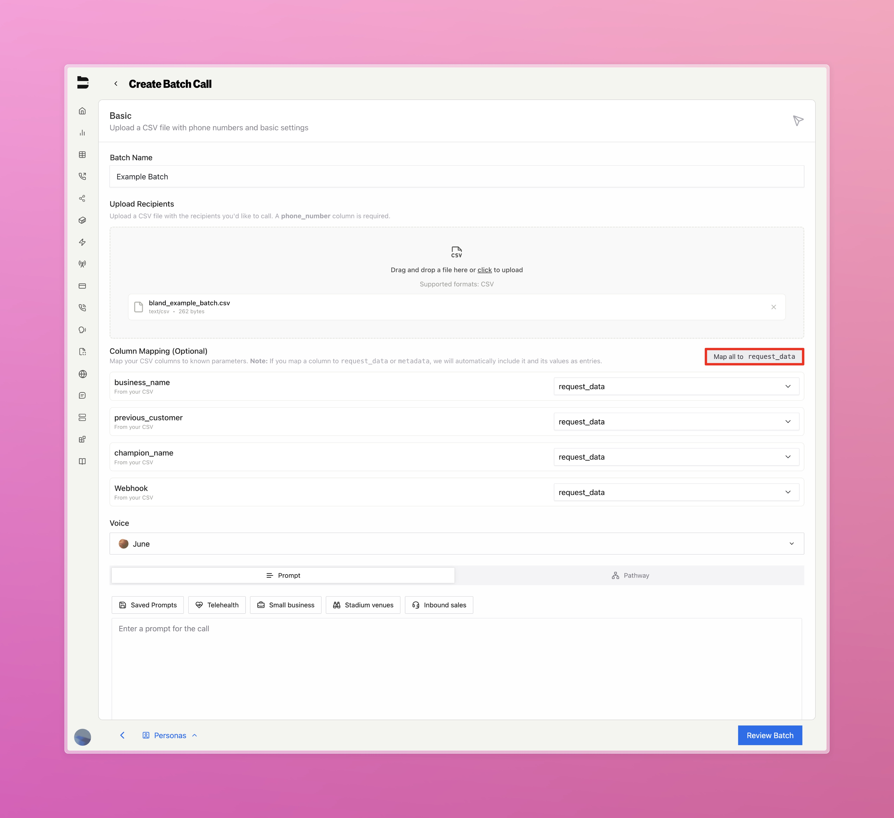

## Introduction

Batch calls let you initiate high-volume call campaigns by uploading a list of recipients via CSV. These calls share a dynamic prompt or pathway, and you can monitor progress and results from a centralized dashboard.

Common use cases include:

<CardGroup cols={2}>
  <Card title="Outbound Campaigns" icon="megaphone">
    Reach customers with limited-time offers or updates.
  </Card>
  <Card title="Customer Reminders" icon="bell">
    Follow up with clients for appointments, payments, or check-ins.
  </Card>
  <Card title="Lead Qualification" icon="headset">
    Qualify or re-engage leads from your CRM or sign-up funnel.
  </Card>
  <Card title="Data Collection" icon="database">
    Prompt users for updated contact info, preferences, or survey responses.
  </Card>
</CardGroup>

---

## Creating a Batch Call

To start a batch call:

1. Navigate to the [Batch Calls](https://app.bland.ai/dashboard/batches) page in the sidebar.
2. Click **Create Batch Call** in the top right.

You'll land on a configuration screen similar to the normal call creation flow, with the addition of a **CSV upload step**.

Batch calls are built around a CSV file containing all information on your recipients, with each row representing a single recipient.



### Required Fields

Your uploaded CSV must include at least one column titled `phone_number`.

Additional columns can be included to define dynamic variables referenced during the call.

> **Important**: Column names cannot contain spaces since they are used as variables in pathways. Use underscores or camelCase instead (e.g., `customer_name` or `customerName`, not `customer name`).

Example format:

| phone_number | business_name    | previous_customer | champion_name | webhook                     |
|--------------|------------------|-------------------|---------------|-----------------------------|
| +12345678909  | South Bay Coffee | Yes               | Sarah H       | https://example.com/webhook1 |
| +10987654321  | John's Laundry   | No                | John W        | https://example.com/webhook2 |

With this CSV, we are aiming to send 2 calls out in our batch, to +12345678909 and +10987654321.

In each of those calls, we can have access to the information in the other columns (business_name, previous_customer, champion_name, webhook) throughout our prompt or pathway, similar to request data in a normal call.

In order to gain access to these, we can either format the CSV column names to prepend 'request_data.' to each column name (request_data.business_name, request_data.previous_customer, etc.) or we can convert them all through our UI:


> Above shows how we set each column to be mapped to use as request data during each call. Alternatively, you can set each column to be mapped to any other call configuration setting.

Once we mark the column as request data, we can reference it in our prompt or pathway using the familiar `{{column_name}}` syntax.

---

## Monitoring Batch Progress

You can monitor batch progress in two ways: **polling** the batch and logs endpoints, or **receiving status webhooks** when using the API.

### Status webhook (API)

When creating a batch via the API, you can pass an optional **`status_webhook`** URL. We will send HTTP POST requests to that URL at each major lifecycle step and when the batch finishes, so you get push updates without polling.

**When we call it:** We POST once per phase: `validating` → `dispatching` → `in_progress` (or `in_progress_chunked` for large batches) → optionally `waiting_for_scheduled_calls` → then one final event: `completed`, `failed`, or `completed_partial`. Each request is JSON with `batch_id`, `status`, and `timestamp`; final events include call counts or error `code` and `reason` when applicable.

**Best practice:** Your endpoint should respond with **200 within a few seconds**. Do any heavy processing asynchronously so the batch workflow is not delayed (we wait up to 10 seconds per webhook call).

See the [Create Batch API reference](/api-v1/post/batches#status-webhook) for the full payload shape and example bodies.

### Dashboard and polling

After launching a batch, return to the [Batch Calls](https://app.bland.ai/dashboard/batches) dashboard

You'll see each batch listed with:

* **Status** (e.g. Completed, Partial, Failed)
* **Batch Name**
* **Batch Timestamp**
* **Batch ID**
* Buttons to **View Logs** and **Cancel** the Batch

### Understanding Batch Statuses

Your batch will progress through various statuses as it processes. Here's what each status means:

<AccordionGroup>
  <Accordion title="Active Statuses (In Progress)">
    - **Initializing** - The batch is being set up and prepared for processing. This happens immediately after creation.
    - **Validating** - The system is verifying your CSV format, phone numbers, and call parameters before dispatching.
    - **Dispatching** - Calls are being actively sent out to recipients from your CSV.
    - **In Progress** - Calls are actively being processed and conversations are ongoing.
    - **In Progress (Chunked)** - Large batches are being processed in smaller chunks for better performance.
    - **Waiting for Scheduled Calls** - The batch is waiting for calls with specific start times to be executed.
  </Accordion>
  
  <Accordion title="Final Statuses (Completed)">
    - **Completed** - All calls in the batch were successfully processed and finished.
    - **Completed Partial** - Some calls succeeded, but some failed or were skipped. Check the logs for details.
    - **Failed** - The entire batch failed to process due to a critical error. Review the error logs for troubleshooting.
  </Accordion>
</AccordionGroup>

---

## Example Use Case

Let's say you're running a follow-up campaign for returning customers

Upload a CSV like:

| phone_number | customer_name | service       | date     |
|--------------|----------------|---------------|----------|
| 12345678909  | Emily          | Home Cleaning | July 10  |

Then set your prompt:

```mdx
Hi {{customer_name}}, just checking in to see if you'd like to 
schedule your next {{service}}. We're available as early as {{date}}. 
Would you like me to get that on the books?
```

The agent will automatically personalize each call using the values from that row in your CSV

---

## Frequently Asked Questions

<AccordionGroup>
  <Accordion title="What happens if a number is invalid?">
    Invalid or blank numbers will be skipped automatically and reported in the error logs
  </Accordion>
  <Accordion title="Can I use tools or pathways with batch calls?">
    Yes. Any tools or pathways configured in your call settings will apply across the batch
  </Accordion>
  <Accordion title="How do I access individual results?">
    Use the Call Logs page (filtered by batch ID) to inspect each call's transcript, outcome, and variables
  </Accordion>
  <Accordion title="How do I send a batch via API?">
    You can use our API to send a batch call. See our [API Reference](/api-v1/post/batches) for more details.
  </Accordion>
</AccordionGroup>


