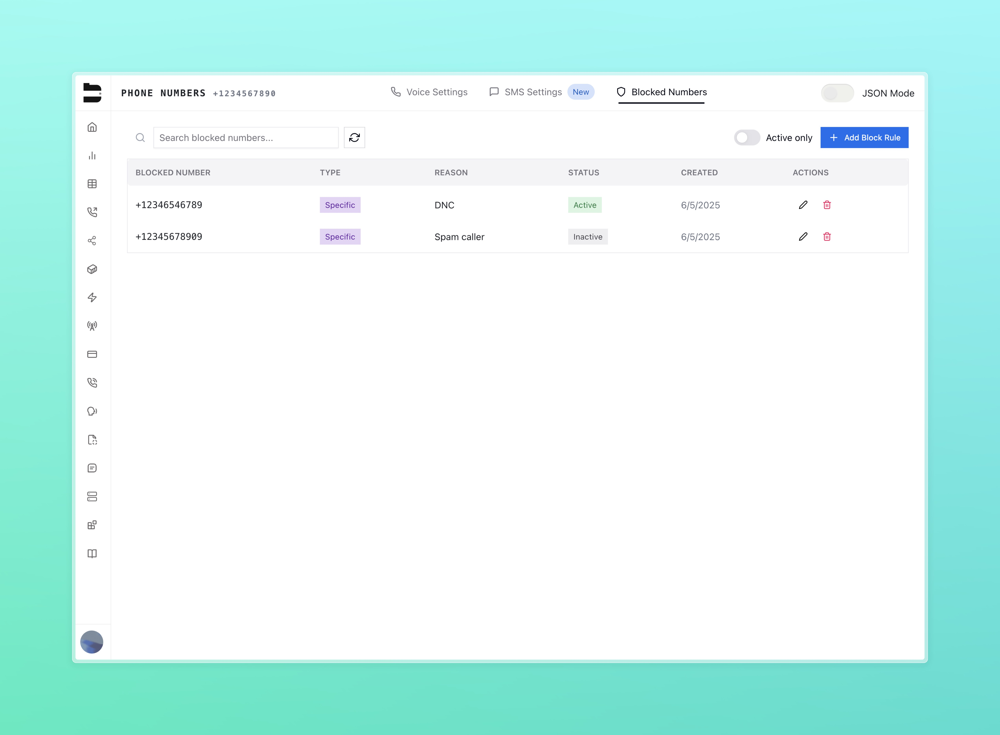

## Overview

The **Blocked Numbers** feature allows you to prevent specific phone numbers from reaching your Bland inbound lines. You can manage these blocks through the main [**Phone Numbers** dashboard](https://app.bland.ai/dashboard/phone-numbers) in two ways:

* **Globally**: Block a number across all your inbound numbers
* **Individually**: Block a number for a specific inbound number only

---

## Global Number Block Rules

From the **Phone Numbers** page in the dashboard, you'll find the **Global Blocked Numbers** button in the top right corner.

Clicking this button opens a list of phone numbers that are blocked across all your inbound lines. Any phone number added here will be rejected automatically, regardless of which inbound number they attempt to call.

---

## Individual Number Block Rules

You can also create block rules specific to a single inbound number.

1. Navigate to the **Phone Numbers** page
2. Click **Setup Call** on the desired number under the configuration column
3. Navigate to the **Blocked Numbers** tab at the top

Here, you can configure block rules that apply **only** to the selected number.

---

## Block Rule Fields

Each block rule in the table includes the following columns:

* **Blocked Number**: The E.164 formatted phone number that is blocked
* **Type**: `global` or `specific`, depending on whether it applies to all numbers or just one
* **Reason**: Optional text indicating why this number was blocked
* **Status**: Indicates if the rule is currently active; can be toggled without deleting
* **Created**: Date the rule was originally added
* **Actions**: Options to edit or delete the rule

---

## Adding Block Rules

When adding new block rules, you can paste or enter numbers in bulk using:

* Comma-separated values (CSV)
* Space-separated values
* New line-separated values

You may also optionally include a reason for blocking the number(s).

---

## Editing Block Rules

Block rules can be edited after creation to:

* Update the **reason**
* Toggle **status** active or inactive

> Note: Once a block rule is created, the phone number itself becomes immutable. You cannot modify or replace it — only the reason and status can be changed.

---

## API Access

You can programmatically manage blocked numbers using our API. 

[View the Blocked Numbers API Documentation](/api-v1/post/blocked-numbers)
