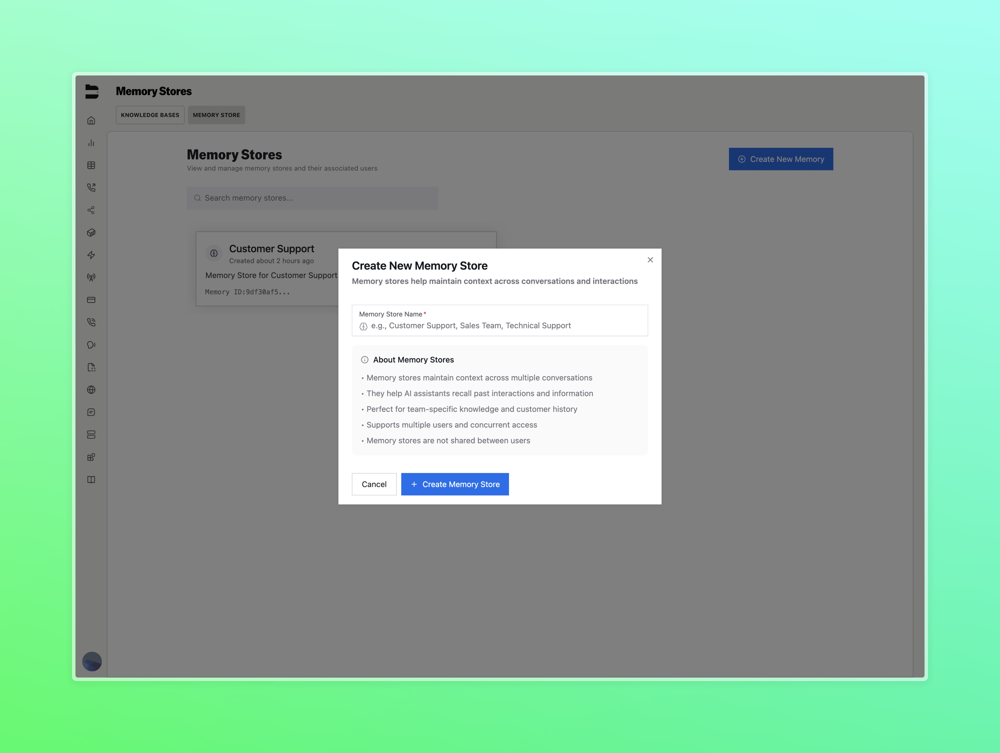
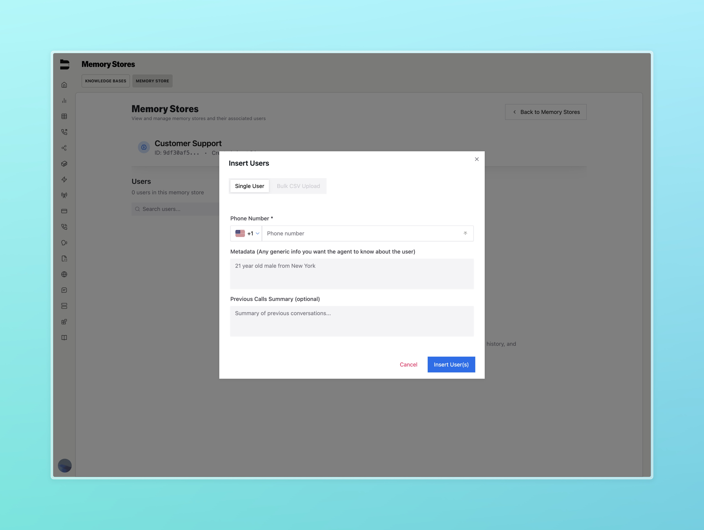
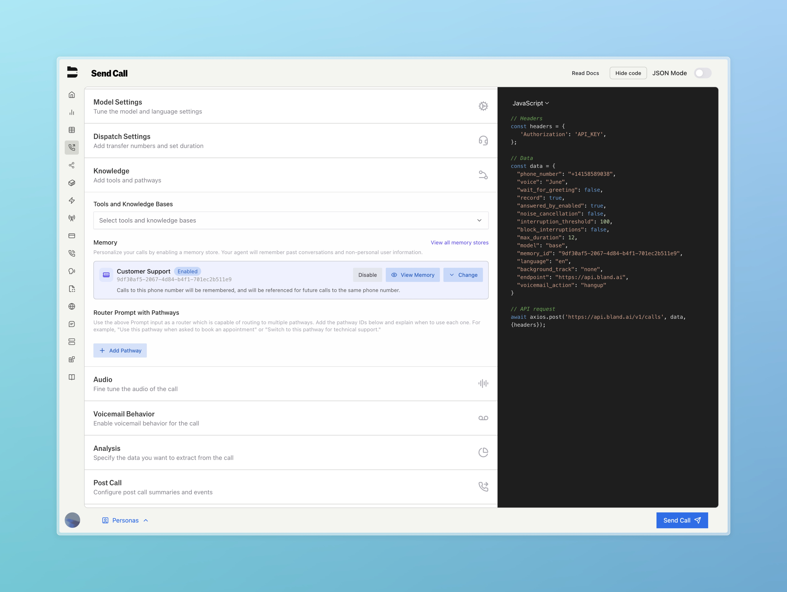

## Introduction

Memory lets Bland agents remember callers between conversations, creating more natural and human-like interactions. When a caller returns, your assistant can reference details from previous calls without needing the user to repeat themselves.

Key capabilities include:

<CardGroup cols={2}>
  <Card title="Persistent Context" icon="book-user">
    Bland automatically links users by phone number or memory ID and recalls their prior interactions.
  </Card>
  <Card title="Multi-Session Awareness" icon="split">
    Keep conversations coherent across separate touchpoints or campaigns.
  </Card>
  <Card title="Personalized Responses" icon="signature">
    Store metadata and summaries for more tailored conversations.
  </Card>
  <Card title="Simple Setup" icon="check">
    Enable memory from the UI or API — no custom logic required.
  </Card>
</CardGroup>

---

## Real-World Example

Imagine a healthcare provider running two campaigns:

- **Medication Adherence** — Bland checks if patients are taking their medication.  
- **Wellness Program** — Bland invites patients to enroll in a new service.

Without memory segmentation, these could blend together. With **Memory IDs**, each campaign stays context-aware and consistent, even across separate calls.

---

## Memory Overview

Memory in Bland is managed through **Memory Stores**, which are collections of user records and associated data. Each record can include:

- Phone Number (used to match users)  
- Metadata (freeform user info)  
- Previous Call Summary (short recap for LLM context)  
- Memory ID (optional — for grouping conversations across a campaign)

---

## Setting Up a Memory Store

To create a memory store:

1. Navigate to [Memory Stores](https://app.bland.ai/dashboard/memory) in your Bland workspace.
2. Click **Create New Memory**
3. Provide a name for your memory store (e.g. “Customer Support”, “Outbound Wellness Campaign”)



---

## Inserting Users and Metadata

Once you've created a memory store, you can optionally add user records:

1. Select a store and click **Insert**
2. Enter the user's phone number (required)  
3. Optionally, include:
   - **Metadata**: Any persistent info like "21-year-old male from New York"  
   - **Previous Calls Summary**: A freeform summary of prior interactions



You can also use the **Bulk CSV Upload** tab to insert multiple users at once.

---

## Attaching Memory to a Call

To enable memory for a call:

1. Go to the Send Call page to create an outbound call
2. Under the Knowledge header, select a memory store from the dropdown



Once selected, this agent will use memory automatically during calls. When a user calls again, Bland will match them by phone number and apply the appropriate context.

If the memory store does not have the current phone number, Bland will create a new record for the user with the information collected after the call.

---

## Optional: Use Memory IDs in API

To group calls by context or campaign, pass a `memory_id` field when making an API request to `/v1/calls`. This allows you to isolate memory usage within a subset of calls.

This is useful when the same user appears in multiple use cases (e.g. Support vs Sales).

```json
{
  "phone_number": "+1234567890",
  "prompt": "Hi there, I wanted to follow up on your onboarding experience.",
  "memory_id": "onboarding_example"
}
```

Learn more about our memory API [here](/api-v1/get/memory).