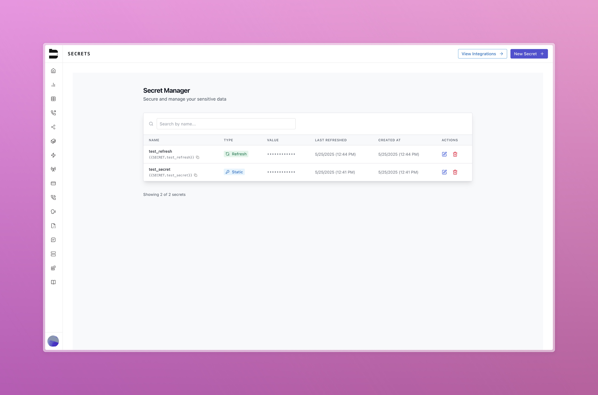
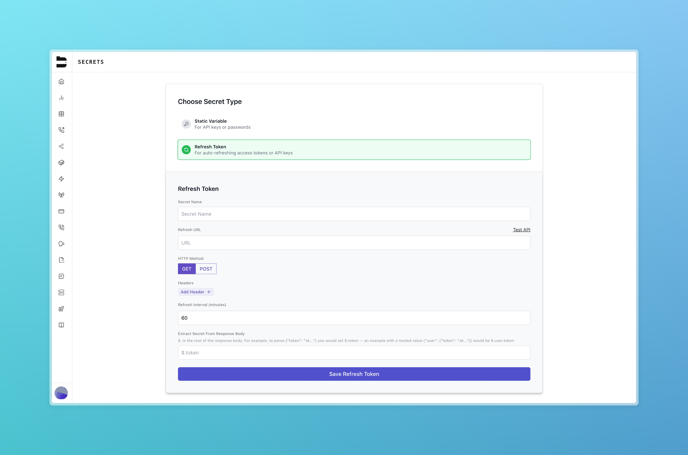
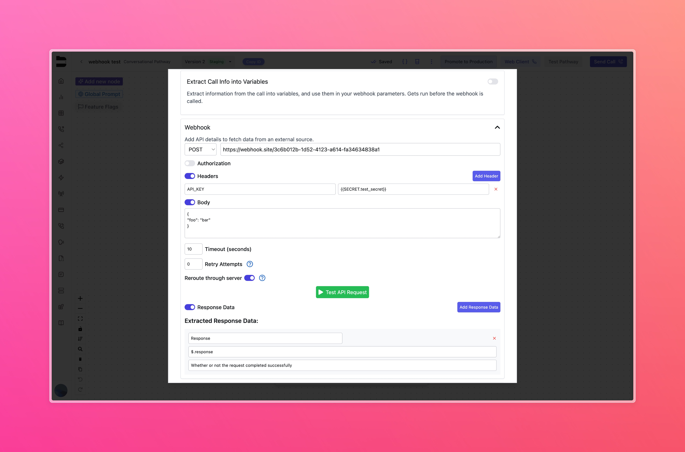
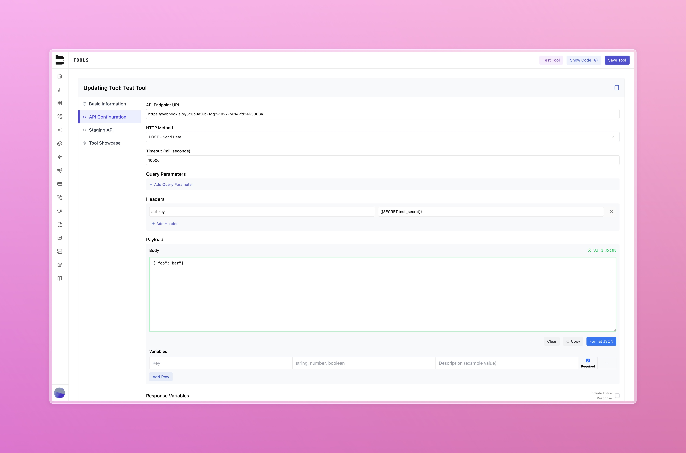

---

title: "Secrets"
description: "How to securely create, store, and reference secrets in workflows."
---

## Introduction

Secrets in Bland allow you to securely store and manage sensitive values such as API keys, access tokens, and other credentials. These secrets can be injected into your prompting without exposing them in plaintext.

To access the secret manager, go to:
[https://app.bland.ai/dashboard/secrets](https://app.bland.ai/dashboard/secrets)



---

## Accessing the Secret Manager

Secrets are located under the **Tools** section in the dashboard. The main view, **Secret Manager**, displays all secrets associated with your account, showing:

* The secret **name**
* The **reference variable format** ([see how to reference secrets](/tutorials/secrets#referencing-secrets))
* The **secret type** (Static or Refresh)

---

## Secret Types

Bland supports two types of secrets:

### Static Secrets

Static secrets are manually entered and do not change unless updated by a user. These are ideal for persistent values like API keys.

**Fields required:**

* Secret name (used to reference the value)
* Secret value (stored encrypted)

### Refreshable Secrets

Refreshable secrets are dynamically fetched from an external service at a defined interval.

**Fields required:**

* Name
* Webhook URL
* HTTP request type (GET or POST)
* Headers (optional)
* Body (if using POST)
* Refresh interval (in minutes; max: 1440 minutes or 24 hours)
* JSON path for extracting the secret value from the response

> **Important Note**: For refreshable secrets, all parameters must be URL encoded and included directly in the webhook URL. Parameters cannot be sent in the request body or through content-type headers, as these options are not supported currently.



---

## Referencing Secrets

Secrets can be referenced in workflows using double curly braces. You can use this variable in your webhook authorization and request headers.

```bash
{{ SECRET.SECRET_NAME }}
```




Additionally, you can use your secrets in your custom tools.



---

## Managing Secrets

* **Edit**: You can update the names of secrets, however secrets cannot be viewed or edited after creation.
* **Delete**: Removes the secret permanently.

---

## Best Practices

* Use lowercase, underscore-separated names (e.g., `slack_token`)
* Never expose secrets directly in plaintext inputs
* Use refreshable secrets for short-lived tokens
* Rotate static secrets regularly