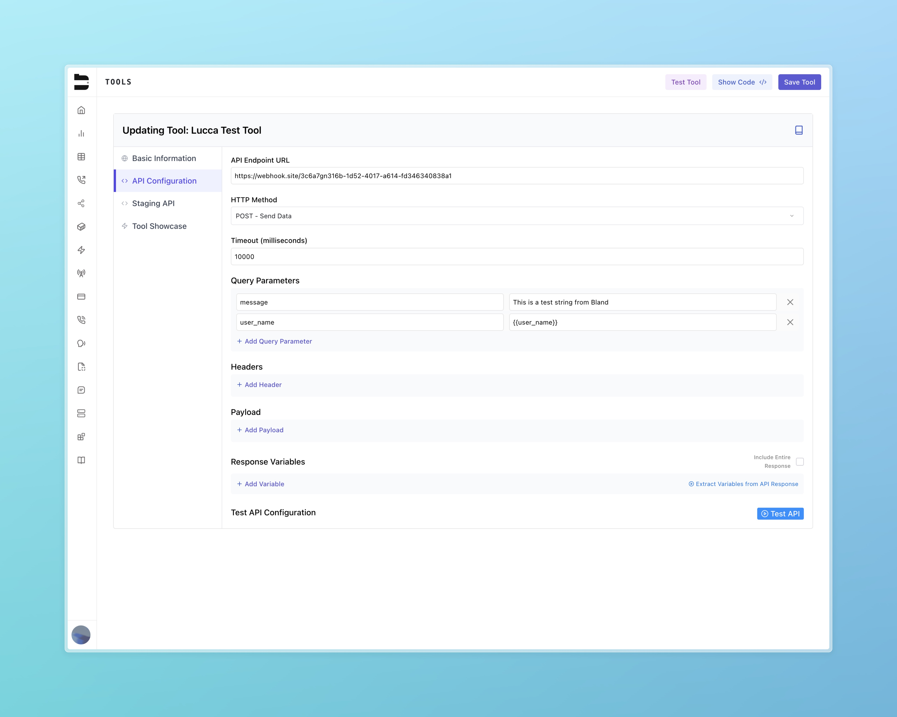

---

title: "Tools"
description: "Create, configure, and use custom tools in your pathways, and prompts."
---

## Introduction

Custom tools in Bland allow you to integrate external APIs into your workflows, prompts, and pathways. You can manage your tools at:
[https://app.bland.ai/dashboard/tools](https://app.bland.ai/dashboard/tools)

There are two main categories of custom tools:

* **Tool Showcase**: A public library of user-contributed tools that can be searched and reused.
* **Your Tools**: Tools you've created and configured, either for private use or sharing.

In addition, Bland offers a growing set of **integrations** for common platforms such as Slack and HubSpot.

---

## Tool Creation Overview

When creating a new custom tool, you'll define four major configuration sections:

### 1. Basic Information

* **Name**: How the tool will be labeled in your UI and logs
* **Description**: A short explanation of what the tool does
* **Speech Prompt (Optional)**: Text your agent should speak when the tool is triggered

### 2. API Configuration

#### API Endpoint URL

The endpoint of the external service.

#### HTTP Method

Choose HTTP method (GET, POST, etc.)

#### Timeout

How long the tool should wait for a response (in ms)

#### Query Parameters

Optional key-value pairs to append to the URL

These query parameters can also be interpolated using variables captured throughout your pathway. For example:



In the above example, the tool will make a request, and replace the variable `{{user_name}}` with the value of the `user_name` collected previously in the pathway.

####   Headers

Headers can reference [Bland Secrets](/tutorials/secrets) for secure credential management.

#### Payload

Add a JSON object to your webhook request.

#### Variables

The variables section is for extracting variables from all the conversation up until the tool is called.

For the agent to capture these variables, you must include its name, variable type, and a detailed description of what the variable is supposed to be.

Once you have added the variables, you can reference them in the body payload of the custom tool with curly braces.

#### Response Mapping

Define which fields from the response are collected to be exposed to the agent.

Best practice is to have a single string for the response variable name.

Use JSON path to extract the value from the response.

For example, if the response is formatted:

```json
{
  "status": "confirmed",
  "response_object": {
    "color": "blue"
  }
}
```

You can set the JSON path for status as `$.status` and for color as `$.response_object.color`.


### 3. Staging API Configuration

* An optional alternate endpoint used for internal testing
* Mirrors the structure of the default configuration
* Toggle between live and staging versions during pathway development

### 4. Tool Showcase Publishing

* Choose to list your tool publicly for others to use
* Public tools appear in the global Tool Showcase with your name as the creator

---

## Using Your Tools

There are two primary ways to apply tools in practice:

### 1. Sending a Call with a Prompt

Within the **Knowledge** dropdown on the Send Call page:

* You can attach one or more tools for your agent to use
* These tools are available during the call when their specific conditions are met
* In your prompt, instruct your agent on when and how to use the tool

**Send Call Prompt Example:**

> Ask the user for their name and age. <br/>
> After they give you their name and age, use your tool "Send User Information" to pass in the `user_name` and `user_age` to the custom tool. <br/>
> And then let the user know the status of the custom tool when you get the response.

This works in tandem with your custom tool configuration:

* The agent will naturally extract variables like `user_name` and `user_age` (see below)
* These can be referenced in your tool configuration using `{{input.user_name}}` and `{{input.user_age}}`
* You can extract response variables from the webhook request (e.g., status) and reference them in the conversation using double curly braces — for example, `{{status}}`. These variables can then be used throughout the rest of the dialogue.


> **Note:** You can include tools within your API requests by passing in an array of tool IDs. See [API documentation](/api-v1/post/calls#param-tools) for details.

### 2. Inside Pathways (Custom Tool Node)

You can insert a custom tool node directly into your pathway:

* Go to **Add New Node** → **Custom Tool**
* Select your tool from the dropdown
* This functions similarly to a webhook node but uses your tool’s configuration
* From this node, you can:

  * Choose between live or staging tool
  * Configure response routing using **After Tool Response** options
  * Access advanced execution settings as needed

> **Important**: Variable extraction does not occur automatically when using a custom tool in a pathway. You must ensure that any variables needed by the tool (e.g. user_name, user_age) are extracted earlier in the pathway using variable extraction or by utilizing the [variables section](/tutorials/tools#variables) of the custom tool. Only variables that have been previously captured will be available to the tool at runtime.

