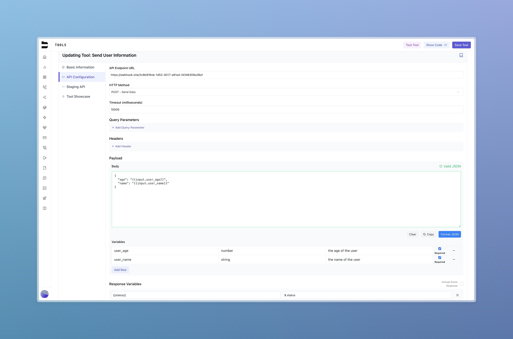
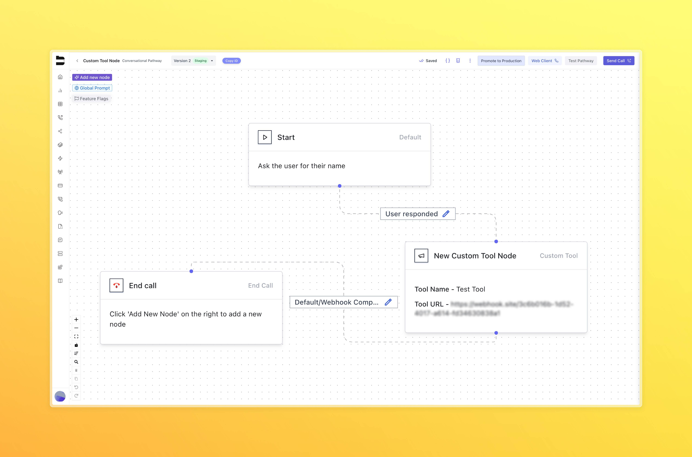

---

title: "Tools"
description: "Create, configure, and use custom tools in your pathways, and prompts."
------------------------------------------------------------------------------------------------

## Introduction

Custom tools in Bland allow you to integrate external APIs into your workflows, prompts, and pathways. You can manage your tools at:
[https://app.bland.ai/dashboard/tools](https://app.bland.ai/dashboard/tools)

There are two main categories of custom tools:

* **Tool Showcase**: A public library of user-contributed tools that can be searched and reused.
* **Your Tools**: Tools you've created and configured, either for private use or sharing.

In addition, Bland offers a growing set of **integrations** for common platforms such as Slack and HubSpot.

---

## Tool Creation Overview

When creating a new custom tool, you'll define four major configuration sections:

### 1. Basic Information

* **Name**: How the tool will be labeled in your UI and logs
* **Description**: A short explanation of what the tool does
* **Speech Prompt (Optional)**: Text your agent should speak when the tool is triggered

### 2. API Configuration

* **Endpoint**: The full URL where the tool will send the request
* **HTTP Method**: GET, POST, etc.
* **Timeout**: How long the tool should wait for a response (in ms)
* **Query Parameters**: Optional key-value pairs to append to the URL
* **Headers**: Custom headers such as authorization or content-type
* **Body**: Only for POST methods — the structure of the request payload
* **Response Mapping**: Define which fields from the response should be exposed to the agent
* **Live Testing**: Test the tool live from the creation interface

### 3. Staging API Configuration

* An optional alternate endpoint used for internal testing
* Mirrors the structure of the default configuration
* Toggle between live and staging versions during pathway development

### 4. Tool Showcase Publishing

* Choose to list your tool publicly for others to use
* Public tools appear in the global Tool Showcase with your name as the creator

---

## Using Your Tools

There are two primary ways to apply tools in practice:

### 1. Sending a Call with a Prompt

Within the **Knowledge** dropdown on the Send Call page:

* You can attach one or more tools to your agent using tool IDs
* These tools are available during the call when conditions are met
* In your prompt, instruct your agent on when and how to use the tool

**Prompt Example:**

> Ask the user for their name and age.
> After they give you their name and age, use your tool "Send User Information" to pass in the `user_name` and `user_age` to the custom tool.
> And then let the user know the status of the custom tool when you get the response.

This works in tandem with your custom tool configuration:

* The agent will naturally extract variables like `user_name` and `user_age`
* These can be referenced in your tool body using `{{input.user_name}}` and `{{input.user_age}}`
* You can define return fields (e.g. `status`) that the agent can reference as `{{status}}`

> **Note:** You can include tools within your API requests by passing in an array of tool IDs. See [API documentation](/api-v1/post/calls#param-tools) for details.

### 2. Inside Pathways (Custom Tool Node)

You can insert a custom tool node directly into your pathway:

* Go to **Add New Node** → **Custom Tool**
* Select your tool from the dropdown
* This functions similarly to a webhook node but uses your tool’s configuration
* From this node, you can:

  * Choose between live or staging tool
  * Configure response routing using **After Tool Response** options
  * Access advanced execution settings as needed

> **Important**: Variable extraction does not occur automatically when using a custom tool in a pathway. You must ensure that any variables needed by the tool (e.g. user_name, user_age) are extracted earlier in the pathway using variable extraction. Only variables that have been previously captured will be available to the tool at runtime.

---

## Summary

Custom tools are a powerful way to integrate external APIs and logic into your conversational workflows. Whether public or private, static or staged, tools let you extend your agent’s abilities with full control over timing, behavior, and usage context.
