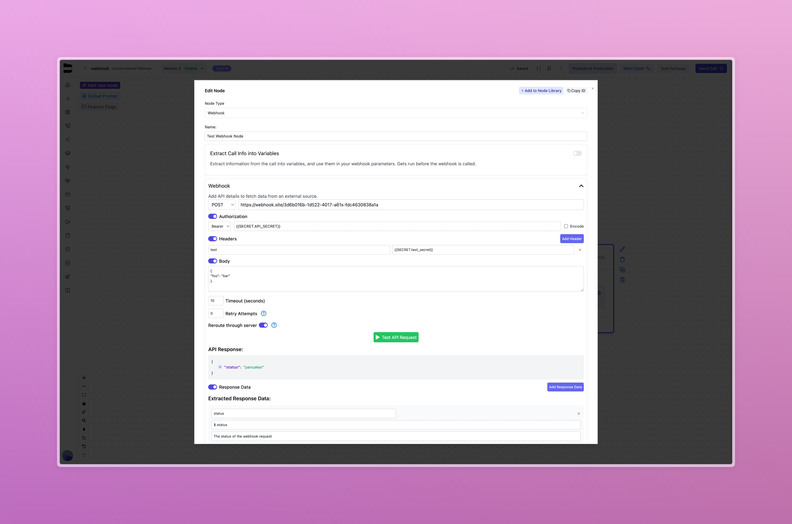
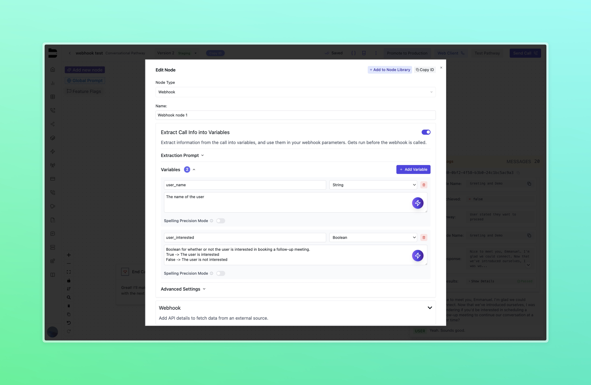
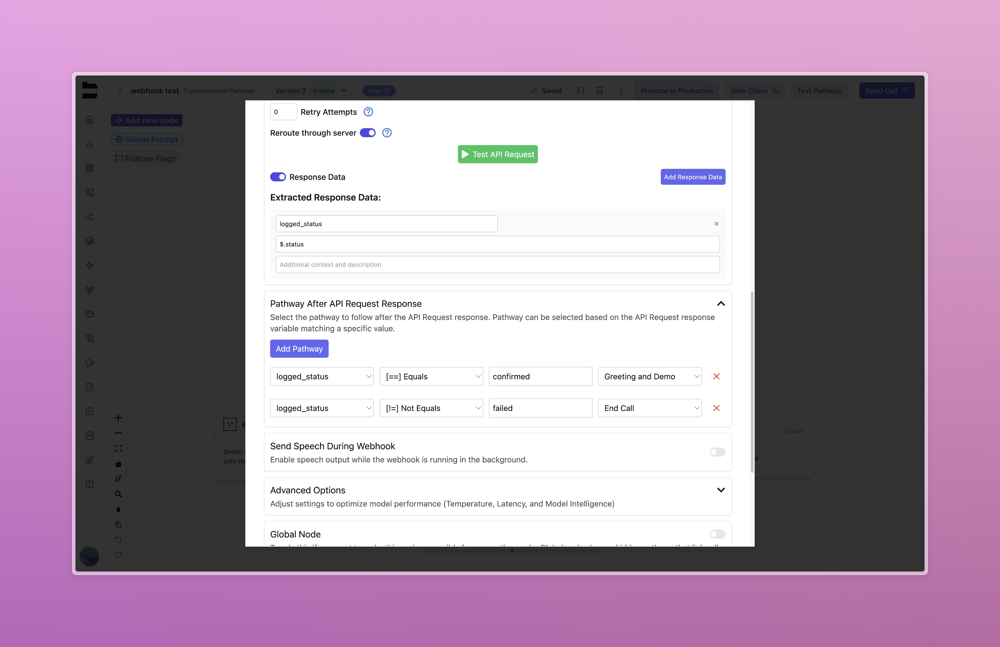

---

title: "Webhooks"
description: "Configure outbound API requests inside your pathways using the webhook node."
---

## Introduction

The webhook node enables outbound API requests to external services during a live call. It can be used to retrieve data, trigger workflows, or pass information to third-party systems.

To add a webhook node:

* Open your pathway
* Click **New Node** in the top left
* Select the **Webhook** icon

---

## Node Configuration

Once added to your pathway, the webhook node includes several configuration options:



### 1. Extract Call Info into Variables

* When enabled, this mirrors the variable extraction behavior found in other default nodes.
* Based on the conversation up until the point of this node, variables will be extracted based on their name and description.



In the above example, the variables `user_name` and `user_interested` are being extracted from the conversation. Up until this node, the objective was given to the agent to discuss the user's basic information and their availability. Based on what was discussed, the agent will extract the user's name, along with a True or False value based on whether the user is interested in a follow up meeting.

These variables can then be included in the webhook. Here is an example body:

```json
{
  "name": "{{user_name}}",
  "interested": "{{user_interested}}"
}
```


### 2. Webhook Configuration

This section defines how the outbound request is sent:

#### Request Type

Choose HTTP method (GET, POST, etc.)

#### URL

The endpoint of the external service.

The URL may include query parameters. For example:

`https://api.example.com/users?id=123&type=new`

These query parameters can also be interpolated using variables captured throughout your pathway. For example:

`https://api.example.com/users?id={{user_id}}&type={{user_type}}`

#### Authorization and Headers

Authorization can be configured as:

- None: No Authorization header is included.
- Bearer: Use this option to authenticate with a bearer token. (Only input the raw token — the Bearer prefix is automatically added)
- Basic: Authenticate with a username and password in base64 format.

Headers and auth tokens can reference [Bland Secrets](/tutorials/secrets) for secure credential management.

#### Body

Compose a payload for your requests.

The body can include static values or variables captured throughout your pathway. For example:

```json
{
  "name": "{{user_name}}",
  "interested": "{{user_interested}}",
  "service": "consultation"
}
```

In addition to the custom variables you create throughout your pathway, you also have access to Bland's built-in variables:

<AccordionGroup>
  <Accordion title="Built-in Variables">
    - `{{phone_number}}` - Always the other party's number
    - `{{country}}` - The country code (ex. US)
    - `{{state}}` - The state or province's abbreviation (ex. CA for California)
    - `{{city}}` - The full city name, capitalized
    - `{{zip}}` - The zip code
    - `{{call_id}}` - The unique ID of the current call
    - `{{now}}` - Current time in the call's timezone
    - `{{now_utc}}` - Current time in UTC format
    - `{{from}}` - The outbound number in E.164 format
    - `{{to}}` - The inbound number in E.164 format
    - `{{short_from}}` - outbound number with country code removed
    - `{{short_to}}` - inbound number with country code removed
  </Accordion>
</AccordionGroup>

### 3. Advanced Settings

* **Timeout**: Maximum wait time before considering the request failed
* **Retries**: Number of retry attempts on failure
* **Reroute through server**: Rerouting through the server helps prevent CORS issues. Disable only if you're experiencing problems with the rerouted requests.
* **Test API Request**: Send a live test request and view raw response or errors

---

## Response Data Mapping

If the webhook returns a JSON response, you can extract specific values into variables for use in subsequent nodes:

* Enable **Response Data**
* For each value to extract:

  * Define a **Variable Name** (single string, e.g. `user_id`)
  * Provide the **JSON Path** (e.g. `$.data.id`)
  * Optionally add a **Description** for additional context

---

## Pathway Routing After Response

Define where to route the agent based on the webhook result:

* This allows conditional routing based on status codes or outcomes.
* Example: route to different nodes if response status is 200 vs. 500.

> Note: Every webhook node requires a route for default API Request Completion before saving for the first time.

Pathways are evaluated from top to bottom, and each condition can overwrite the previous result:

* If the first pathway to follow points to node "a" and evaluates to true, the next node is set to "a".
* If the second pathway to follow points to node "b" and also evaluates to true, it will overwrite the previous result — the next node will now be "b".

In the following example, if the variable "logged_status" extracted from the webhook response is "confirmed", the agent will evaluate the first condition to true. It will then evaluate the second condition to true. Since we overwrite and save the last true pathway, the agent will go to the End Call node.




After all conditions are evaluated, the last true condition determines which pathway is followed.

> Important: If any pathway uses **API Request Completion (Default)**, and it evaluates to true, it will take precedence and override all other conditions.

---

## Speech During Webhook

Enable the agent to speak while the webhook is processing:

* Useful for avoiding awkward silences during longer API requests
* Example speech: *"One moment while I look up your information."*
* This speech can be static text or AI-generated based on prompting.